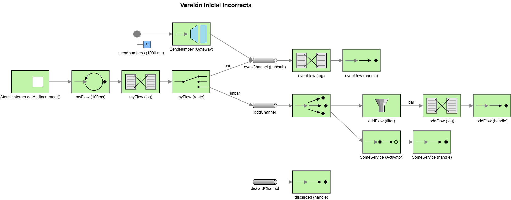
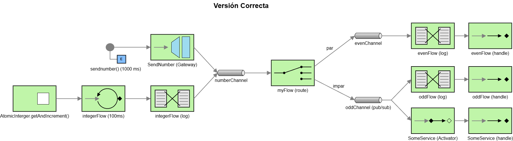

# Lab 5 Integration and SOA – Project Report

## 1. EIP Diagram (Before)

It seems that the intention of the original code was to filter incoming numbers into even and odd, coming both from an
internal number-supplying class and from an external gateway. Afterwards, odd numbers were supposed to trigger a 
service call. However, the system contained several design issues.

---

## 2. What Was Wrong (After Diagram)

- The numbers injected through the Gateway were being sent directly to `evenChannel` without checking whether they were 
even or not. To fix this, a new `numberChannel` was created. Both the numbers produced by the local supplier and the 
ones coming from the Gateway now flow through this common channel, and are then routed coherently.

- `evenChannel` was declared as a pub/sub channel without any need for broadcast behavior, so it was changed to a 
standard point-to-point channel.

- `oddChannel` originally caused competition between its consumers, which was not the intended behavior. To fix this, 
it was redefined as a publish–subscribe channel.

- The filter inside `oddFlow` was redundant and did not add any meaningful logic, so it was removed.

- Both `discardChannel` and its associated handler were unused, so they were removed entirely.

---

## 3. What You Learned

I think the most important thing I learned is the value and importance of good documentation and clear EIP design.  
When the architecture is well defined, the implementation becomes straightforward once you understand the syntax, which 
is also very readable.  
I did not encounter major challenges thanks to the initial code, which, despite being architecturally incorrect, was 
syntactically sound.

---

## 4. AI Disclosure

I used ChatGPT to review my documentation and to translate this report.
